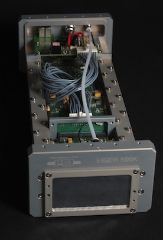

.. _camera-slsdetector:

SlsDetector camera
--------------



Introduction
````````````
The PSI/SLS Detector Group has developed a family of X-ray detectors: Mythen, Pilatus, Gotthard, 
Eiger, Moench, Jungrau, among others. Most of them are controlled through Ethernet interfaces, 
with optional dedicated data link(s). A common protocol has been developed to control these detectors, 
based on the *slsDetector* class. A separate software entity receives and dispatch the data: *slsReceiver*. 
The SlsDetector LIMA plugin instantiates the necessary software objects to perform data aquisitions 
with the detectors supported by the slsDetectorsPackage.

The current implementation only works with the PSI/Eiger detectors.

Prerequisite
````````````
The slsDetectorsPackage-v2.3.x is needed by the SlsDetector LIMA plugin. In particular, 
the *libSlsDetector.so* and *libSlsReceiver.so* shared libraries must be reachable from the *LD_LIBRARY_PATH*. 
In addition to that, a *configuration file*, containing the commands necessary to initialise both 
the *slsDetector" and *slsReceiver* instances, is required. 

The library protocol uses Unix System-V IPC shared memory blocks to exchange information between processes. 
The segments, referred to by keys matching hex *000016xx*, must be owned by the user running the plugin, 
if it is not *root*. The following command, which removes the existing segments, must be run by the segments' owner (or *root*) so they 
can be deleted/created by another user:

.. code-block:: sh

  ipcs -m | \
    grep -E '^0x000016[0-9a-z]{2}' | \
    awk '{print $2}' | while read m; do \
      ipcrm -m $m; \
  done

High-performance Acquisitions
.............................

Some Linux configuration is needed for high-performance data acquisition. Please refer to the 
(ESRF on-site only) following documentation:

  http://wikiserv.esrf.fr/id01/index.php/NOTES_on_ID01_PSI_EIGER

Installation & Module configuration
````````````````````````````````````

- follow first the steps for the linux installation :ref:`linux_installation`

The minimum configuration file is *config.inc* :

.. code-block:: sh

 COMPILE_CORE=1
 COMPILE_SIMULATOR=0
 COMPILE_SPS_IMAGE=1
 COMPILE_ESPIA=0
 COMPILE_FRELON=0
 COMPILE_MAXIPIX=0
 COMPILE_PILATUS=0
 COMPILE_BASLER=0
 COMPILE_PROSILICA=0
 COMPILE_ROPERSCIENTIFIC=0
 COMPILE_MYTHEN=0
 COMPILE_MYTHEN3=0
 COMPILE_ADSC=0
 COMPILE_UEYE=0
 COMPILE_XH=0
 COMPILE_XSPRESS3=0
 COMPILE_ULTRA=0
 COMPILE_XPAD=0
 COMPILE_PERKINELMER=0
 COMPILE_ANDOR=0
 COMPILE_ANDOR3=0
 COMPILE_PHOTONICSCIENCE=0
 COMPILE_PCO=0
 COMPILE_MARCCD=0
 COMPILE_POINTGREY=0
 COMPILE_IMXPAD=0
 COMPILE_DEXELA=0
 COMPILE_RAYONIXHS=0
 COMPILE_AVIEX=0
 COMPILE_META=0
 COMPILE_MERLIN=0
 COMPILE_V4l2=0
 COMPILE_EIGER=0
 COMPILE_PIXIRAD=0
 COMPILE_HEXITEC=0
 COMPILE_SLSDETECTOR=1
 COMPILE_CBF_SAVING=0
 COMPILE_NXS_SAVING=0
 COMPILE_FITS_SAVING=0
 COMPILE_EDFGZ_SAVING=1
 COMPILE_EDFLZ4_SAVING=0
 COMPILE_TIFF_SAVING=0
 COMPILE_HDF5_SAVING=0
 COMPILE_CONFIG=1
 COMPILE_GLDISPLAY=0
 LINK_STRICT_VERSION=0
 export COMPILE_CORE COMPILE_SPS_IMAGE COMPILE_SIMULATOR \
        COMPILE_ESPIA COMPILE_FRELON COMPILE_MAXIPIX COMPILE_PILATUS \
        COMPILE_BASLER COMPILE_PROSILICA COMPILE_ROPERSCIENTIFIC COMPILE_ADSC \
        COMPILE_UEYE COMPILE_XH COMPILE_XSPRESS3 COMPILE_ULTRA COMPILE_XPAD COMPILE_PERKINELMER \
        COMPILE_MYTHEN COMPILE_MYTHEN3 COMPILE_HEXITEC \
        COMPILE_ANDOR COMPILE_ANDOR3 COMPILE_PHOTONICSCIENCE COMPILE_PCO COMPILE_MARCCD COMPILE_DEXELA \
        COMPILE_POINTGREY COMPILE_IMXPAD COMPILE_RAYONIXHS COMPILE_AVIEX COMPILE_META COMPILE_MERLIN COMPILE_V4l2 COMPILE_EIGER COMPILE_PIXIRAD \
        COMPILE_SLSDETECTOR \
        COMPILE_CBF_SAVING COMPILE_NXS_SAVING COMPILE_FITS_SAVING COMPILE_EDFGZ_SAVING COMPILE_EDFLZ4_SAVING COMPILE_TIFF_SAVING \
        COMPILE_HDF5_SAVING COMPILE_CONFIG COMPILE_GLDISPLAY \
        LINK_STRICT_VERSION

-  start the linux compilation :ref:`linux_compilation`

-  finally with the Tango server installation :ref:`tango_installation`

Initialisation and Capabilities
````````````````````````````````
In order to help people to understand how the camera plugin has been implemented in LImA this section
provides some important information about the developer's choices.

Camera initialisation
......................
The SlsDetector plugin exports to kind classes: one generic *SlsDetector::Camera* class, with the common
interface to *slsDetector* and *slsReceiver* classes, and detector-specific classes, like *SlsDetector::Eiger* 
which manage the particularities of each model.

First, the *SlsDetector::Camera* must be instantiated with the configuration file, and once the connection to
the detector is established, a specific class is created depending on the detected type:

.. code-block:: python

    cam = SlsDetector.Camera(config_fname)
    if cam.getType() == SlsDetector.Camera.EigerDet:
        eiger = SlsDetector.Eiger(cam)
    else:
        raise RuntimeError("Non-supported type: %s" % cam.getType())

    hw_inter = SlsDetector.Interface(cam)
    ct = Core.CtControl(hw_inter)

The raw images returned by the *slsReceiver* class might need to be reconstructed, like in the case of 
the PSI/Eiger detector. A LImA software reconstruction task must be then created from the LImA plugin and registered 
to the *Core::CtControl* layer:

    if cam.getType() == SlsDetector.Camera.EigerDet:
        corr = eiger.createCorrectionTask()
        ct.setReconstructionTask(corr)

Std capabilites
................

This plugin has been implemented in respect of the mandatory capabilites but with limitations according 
due to the detector specific features and with some programmer's  choices.  We do not explain here the 
standard Lima capabilites but you can find in this section the useful information on the SlsDetector specfic features.

* HwDetInfo

TODO  

* HwSync

The following trigger modes are currently implemented:

  + IntTrig
  + ExtTrigSingle
  + ExtTrigMult
  + ExtGate

The minimum *latency_time* is currently fixed to 100 us.

Optional capabilites
........................
In addition to the standard capabilities, we make the choice to implement some optional capabilities in order to 
have an improved simulation.

* HwShutter

*Not implemented* 

* HwRoi

*Not implemented* 

* HwBin 

*Not implemented* 

Configuration
`````````````

The main configuration will consist in providing the correct *config file* file to the *slsDetector API*.
As mentioned before, the file is a list of commands accepted by *sls_detector_put*, and it should also
work with the *slsDetectorGui* application.

Two important parameters define the image frame dimension:

* PixelDepth:

  + 4 bit (not implemented yet)
  + 8 bit
  + 16 bit
  + 32 bit

* RawMode:

If set to *True*, the image is exported to LiMA as given from the Receiver(s), without any software reconstruction.

How to use
````````````
The LimaCCDs Tango server provides a complete interface to the SlsDetector plugin so feel free to test.

For a quick test one can use Python, this a short code example to work with the PSI/Eiger detector:

.. code-block:: python

  from Lima import SlsDetector
  from Lima import Core
  import time
  import sys

  config_fname = sys.argv[1]

  cam = SlsDetector.Camera(config_fname)
  if cam.getType() != SlsDetector.Camera.EigerDet:
    raise RuntimeError("Non-supported type: %s" % cam.getType())

  eiger = SlsDetector.Eiger(cam)
  hw_inter = SlsDetector.Interface(cam)
  ct = Core.CtControl(hw_inter)
  corr = eiger.createCorrectionTask()
  ct.setReconstructionTask(corr)

  acq = ct.acquisition()

  # setting new file parameters and autosaving mode
  saving = ct.saving()

  pars = saving.getParameters()
  pars.directory = '/tmp'
  pars.prefix = 'test_slsdetector_'
  pars.suffix = '.edf'
  pars.fileFormat = Core.CtSaving.EDF
  pars.savingMode = Core.CtSaving.AutoFrame
  saving.setParameters(pars)

  # now ask for 0.2 sec. exposure and 10 frames
  acq.setAcqExpoTime(0.2)
  acq.setAcqNbFrames(10) 
  
  ct.prepareAcq()
  ct.startAcq()

  # wait for last image (#9) ready
  lastimg = ct.getStatus().ImageCounters.LastImageReady
  while lastimg != 9:
    time.sleep(0.1)
    lastimg = ct.getStatus().ImageCounters.LastImageReady
 
  # read the first image
  im0 = ct.ReadImage(0)

  # cleanup in good order
  import gc
  del acq; gc.collect()
  del ct; gc.collect()
  del corr; gc.collect()
  del eiger; gc.collect()
  del hw_inter; gc.collect()
  del cam; gc.collect()

A more complete **test_slsdetector_control.py** Python script can be found under the *camera/slsdetector/test* directory.
  
